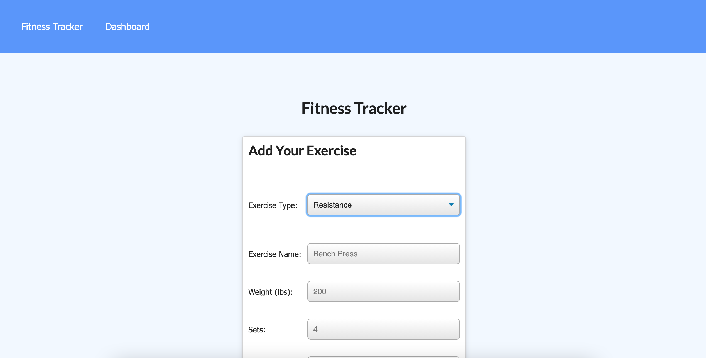

# Fitness-Tracker

In this app you will be able to track data from your workouts. Such as, reps, exercise, weight, duration, etc. This is achieved through entry and display feautures.

---

## **Table of Contents**

1. [Links](#Links)
2. [Installation](#Installation)
3. [Technologies Used](#Technologies-Used)

---

## **Links**

https://github.com/dkim525/Fitness-Tracker

## **Installation**
You can start this this application by first:

``npm i``

## **Links**

[GitHub repository](https://github.com/dkim525/Fitness-Tracker)

---
## **Technologies Used**
* MongoDB
* Node.js
* Express.js